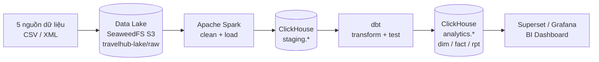
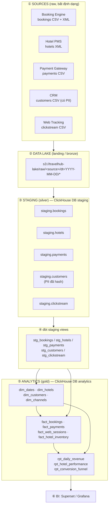
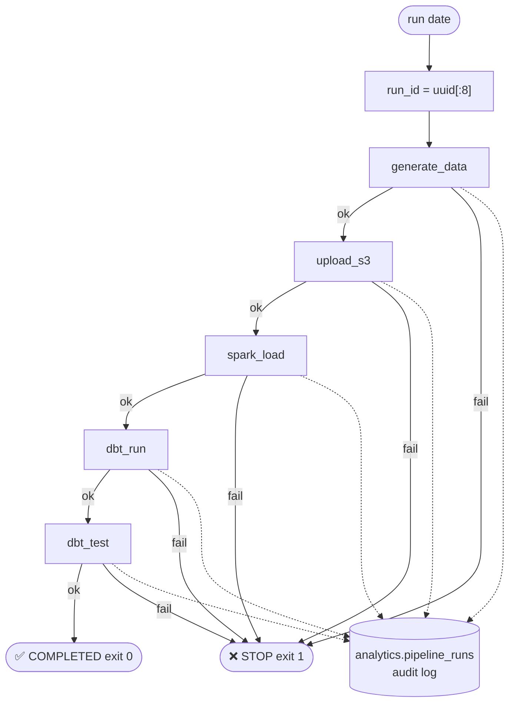
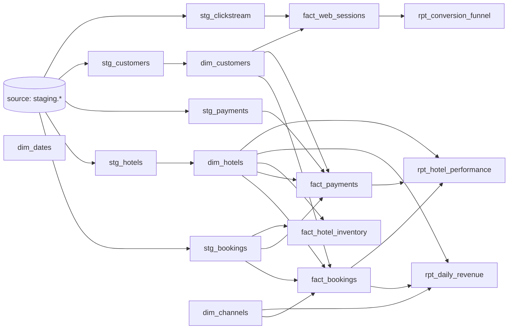
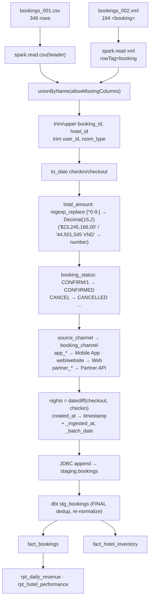
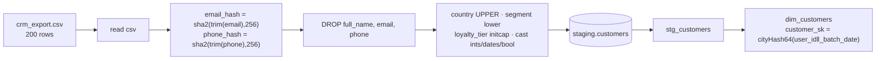
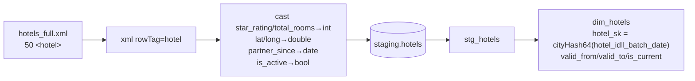
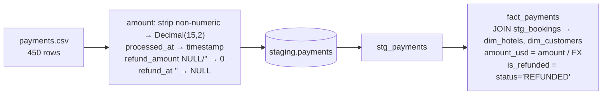
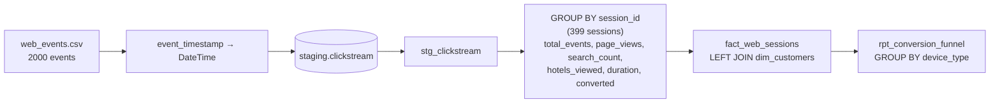
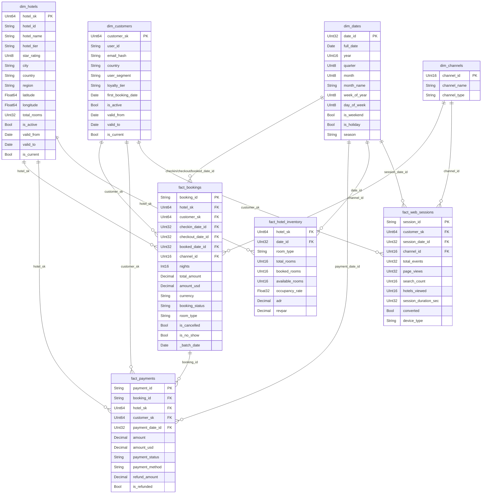

# TravelHub Data Platform — Demo: Data Structure & Pipeline Flow

> Tài liệu phục vụ demo: schema input → các bước trung gian → output, và flow pipeline từ **high level → low level**.
> Mọi số liệu lấy từ sample batch `dt=2026-10-01` trong `data/sample/raw/`.

## Mục lục
1. [Level 0 — Bức tranh tổng thể](#level-0--bức-tranh-tổng-thể)
2. [Level 1 — Các giai đoạn pipeline](#level-1--các-giai-đoạn-pipeline)
3. [Level 2 — Orchestration & chi tiết từng step](#level-2--orchestration--chi-tiết-từng-step)
4. [Level 3 — Biến đổi dữ liệu theo từng entity (low level)](#level-3--biến-đổi-dữ-liệu-theo-từng-entity-low-level)
5. [INPUT: Raw data schema](#input-raw-data-schema)
6. [INTERMEDIATE: Staging (ClickHouse)](#intermediate-staging-clickhouse)
7. [OUTPUT: Analytics (Star schema + Reports)](#output-analytics-star-schema--reports)
8. [Data lineage (column level)](#data-lineage-column-level)
9. [Data quality issues cố ý trong sample (điểm nhấn demo)](#data-quality-issues-có-ý-trong-sample)
10. [Lưu ý / known issues](#lưu-ý--known-issues)
11. [Kịch bản demo gợi ý](#kịch-bản-demo-gợi-ý)

---

## Level 0 — Bức tranh tổng thể



| Thành phần | Công nghệ | Container |
|---|---|---|
| Data Lake (S3) | SeaweedFS | `travelhub-seaweedfs-*` |
| Processing | Apache Spark 3.5.3 | `travelhub-spark-master/worker` |
| DWH | ClickHouse 24.3 | `travelhub-clickhouse` |
| Transform | dbt Core + dbt-clickhouse | chạy trong `travelhub-pipeline` |
| Orchestrator | Python (`scripts/run_pipeline.py`) | `travelhub-pipeline` |
| BI / Monitoring | Superset 3.1 / Grafana | `travelhub-superset/grafana` |

---

## Level 1 — Các giai đoạn pipeline



| Giai đoạn | Layer | Vị trí | Format | Engine |
|---|---|---|---|---|
| ① Source | Raw | file hệ thống nguồn | CSV, XML | — |
| ② Landing | Bronze | `s3://travelhub-lake/raw/...` | CSV, XML (giữ nguyên) | boto3 upload |
| ③ Staging | Silver | `staging.*` | ClickHouse tables | Spark (JDBC) |
| ④ stg views | Silver+ | `staging` schema (dbt view) | view | dbt |
| ⑤ Analytics | Gold | `analytics.*` | tables | dbt |

---

## Level 2 — Orchestration & chi tiết từng step

### 2.1 Sequence (do [run_pipeline.py](file:///c:/Users/admin/Desktop/Master/DE/scripts/run_pipeline.py) điều phối)

```mermaid
sequenceDiagram
    autonumber
    participant U as User / cron (02:00)
    participant O as run_pipeline.py
    participant G as generate_sample_data.py
    participant S3 as SeaweedFS S3
    participant SP as Spark (load_clickhouse.py)
    participant CH as ClickHouse
    participant D as dbt

    U->>O: python run_pipeline.py 2026-10-01
    O->>G: step 0 generate_data
    G-->>O: CSV/XML → data/sample/raw/*/dt=...
    O->>CH: audit_log(generate_data, SUCCESS)
    O->>S3: step 1 upload_s3 (boto3)
    S3-->>O: raw/&lt;source&gt;/dt=.../file
    O->>SP: step 2 spark-submit load_clickhouse.py date raw_path
    SP->>CH: JDBC append → staging.*
    O->>D: step 3 dbt run --vars execution_date
    D->>CH: views → dims → facts → reports
    O->>D: step 4 dbt test
    D->>CH: not_null / unique checks
    O->>CH: INSERT analytics.pipeline_runs (audit mỗi step)
    Note over O: Step nào FAILED → dừng, bỏ qua các step sau
```

### 2.2 Control flow & failure handling



- Mỗi step chạy bằng `subprocess` (timeout 600s), kết quả ghi vào `analytics.pipeline_runs`.
- Spark/dbt nhận tham số `execution_date` → **idempotent theo ngày** (ReplacingMergeTree + `delete+insert`).

### 2.3 Thứ tự chạy dbt (DAG)



Materialization (từ [dbt_project.yml](file:///c:/Users/admin/Desktop/Master/DE/dbt_project/dbt_project.yml)): staging = `view`, dimensions = `table`, marts = `incremental (delete+insert)`, reporting = `table`.

---

## Level 3 — Biến đổi dữ liệu theo từng entity (low level)

### 3.1 Bookings (2 format → 1 bảng)



### 3.2 Customers (PII masking)



### 3.3 Hotels (XML)



### 3.4 Payments



### 3.5 Clickstream → Sessions → Funnel



### 3.6 Quy đổi tiền tệ (hard-coded trong `fact_bookings`, `fact_payments`)

| Currency | amount_usd |
|---|---|
| VND | `/ 24500` |
| THB | `/ 35` |
| SGD | `/ 1.35` |
| IDR | `/ 15500` |
| USD (khác) | giữ nguyên |

---

## INPUT: Raw data schema

Layout: `data/sample/raw/<source>/dt=YYYY-MM-DD/<file>` (Hive-style partition theo ngày).

| Source | File | Format | Rows (sample) |
|---|---|---|---|
| bookings | `bookings_001.csv` | CSV | 346 |
| bookings | `bookings_002.xml` | XML (`<bookings><booking>…`) | 164 |
| hotels | `hotels_full.xml` | XML (`<hotels><hotel>…`) | 50 |
| payments | `payments.csv` | CSV | 450 |
| customers | `crm_export.csv` | CSV | 200 |
| clickstream | `web_events.csv` | CSV | 2000 |

> Tất cả field input đều là **string** (CSV không có schema; XML dạng text) → kiểu dữ liệu được ép ở bước Spark.

### 1. bookings (CSV + XML cùng schema)

| Column | Ví dụ | Ghi chú |
|---|---|---|
| booking_id | `BK-00000002` | PK; có trùng lặp (~10 dòng trong CSV) |
| hotel_id | `HTL-00000042` | FK → hotels |
| user_id | `USR-00000144` | FK → customers |
| room_type | `Family`, `Suite`, `Executive` | |
| checkin_date / checkout_date | `2026-10-15` | `yyyy-MM-dd` |
| total_amount | `"19,236,166.00"`, `"$23,245,166.00"`, `44,501,545 VND` | **dirty**: dấu phẩy, ký hiệu tiền tệ |
| currency | `USD`, `VND`, `SGD`, `THB`, `IDR` | |
| booking_status | `PENDING`, `CONFIRMED`, `confirm`, `1`, `CANCELLED`, `NO_SHOW` | **dirty**: nhiều biến thể |
| source_channel | `app_ios`, `app_android`, `web`, `website`, `partner_abc`, `partner_xyz` | |
| payment_method | `CREDIT_CARD`, `EWALLET`, `BANK_TRANSFER` | |
| created_at | `2026-10-01 15:01:06` | |

XML mẫu:
```xml
<booking>
  <booking_id>BK-00000001</booking_id>
  <hotel_id>HTL-00000022</hotel_id>
  <user_id>USR-00000075</user_id>
  <room_type>Family</room_type>
  <checkin_date>2026-11-19</checkin_date>
  <checkout_date>2026-12-03</checkout_date>
  <total_amount>44,501,545 VND</total_amount>
  <currency>VND</currency>
  <booking_status>CONFIRMED</booking_status>
  <source_channel>website</source_channel>
  <payment_method>EWALLET</payment_method>
  <created_at>2026-10-01 04:56:48</created_at>
</booking>
```

### 2. hotels (XML)

| Field | Ví dụ |
|---|---|
| hotel_id | `HTL-00000001` |
| hotel_name | `Singapore Luxury Hotel 1` |
| hotel_tier | `luxury` / `standard` / `budget` (20/19/11) |
| star_rating | `1`–`5` |
| city / country / region | `Singapore` / `SG` / `Central` |
| latitude / longitude | `14.785581` / `107.939209` |
| total_rooms | `283` |
| facilities | `['bar', 'beach', 'parking']` (chuỗi kiểu Python list) |
| partner_since | `2020-08-01` |
| is_active | `true` / `false` |

### 3. payments (CSV)

| Column | Ví dụ | Ghi chú |
|---|---|---|
| payment_id | `PAY-00000001` | PK (không trùng) |
| booking_id | `BK-00000105` | FK → bookings |
| amount | `47835007` | |
| currency | `THB`, `VND`, `USD` | |
| payment_method | `CREDIT_CARD`, `BANK_TRANSFER` | |
| payment_status | `SUCCESS` 118 · `PENDING` 93 · `REFUNDED` 122 · `FAILED` 117 | |
| gateway_code | `E01`, `TIMEOUT` | |
| processed_at | `2026-10-01 00:15:00` | |
| refund_amount | `0` | |
| refund_at | *(rỗng)* | nullable |

### 4. customers (CSV, chứa PII)

| Column | Ví dụ | Ghi chú |
|---|---|---|
| user_id | `USR-00000001` | PK |
| full_name | `Hoang Thanh` | 🔒 PII → bị DROP |
| email | `hoang.thanh1@email.com` | 🔒 PII → SHA-256 |
| phone | `+84499063796` | 🔒 PII → SHA-256 |
| country | `VN` | |
| user_segment | `premium`, `budget` | |
| loyalty_tier | `Silver`, `Gold` | |
| loyalty_points | `30493` | |
| first_booking_date | `2025-01-15` | |
| total_bookings | `38` | |
| is_active | `true` | |
| registered_at | `2021-01-25` | |

### 5. clickstream (CSV)

| Column | Ví dụ | Ghi chú |
|---|---|---|
| event_id | `EVT-00000001` | PK |
| session_id | `95ea0c97` | 399 session / 2000 event |
| user_id | `USR-00000065` | nullable (~617 event ẩn danh) |
| event_type | `search`, `page_view`, `click`, `booking_start`, `booking_complete` | |
| page_url | `/search`, `/promotions` | |
| hotel_id | `HTL-00000031` | nullable |
| search_query | | nullable |
| device_type | `mobile` 719 · `tablet` 635 · `desktop` 646 | |
| os | `iOS` | |
| event_timestamp | `2026-10-01 07:33:49` | |

---

## INTERMEDIATE: Staging (ClickHouse)

Định nghĩa tại [01_init_schema.sql](file:///c:/Users/admin/Desktop/Master/DE/clickhouse/init/01_init_schema.sql). Tất cả: `ENGINE = ReplacingMergeTree(_batch_date)`, `PARTITION BY toYYYYMM(_batch_date)`.
Mỗi bảng có thêm 3 cột metadata: `_ingested_at DateTime`, `_source_file String`, `_batch_date Date`.

| Table | ORDER BY | Các cột chính (type) |
|---|---|---|
| `staging.bookings` | `booking_id` | booking_id, hotel_id, user_id, room_type: String · checkin/checkout_date: Date · total_amount: Decimal(15,2) · currency, booking_status, booking_channel, payment_method: String · nights: Int16 · created_at: DateTime |
| `staging.hotels` | `hotel_id` | hotel_id, hotel_name, hotel_tier, city, country, region, facilities: String · star_rating: UInt8 · latitude/longitude: Float64 · total_rooms: UInt32 · partner_since: Date · is_active: Bool |
| `staging.payments` | `payment_id` | payment_id, booking_id, currency, payment_method, payment_status, gateway_code: String · amount, refund_amount: Decimal(15,2) · processed_at: DateTime · refund_at: Nullable(DateTime) |
| `staging.customers` | `user_id` | user_id, **email_hash**, **phone_hash**, country, user_segment, loyalty_tier: String · loyalty_points, total_bookings: UInt32 · first_booking_date, registered_at: Date · is_active: Bool |
| `staging.clickstream` | `event_id` | event_id, session_id, event_type, page_url, device_type, os: String · user_id, hotel_id, search_query: Nullable(String) · event_timestamp: DateTime |

**Biến đổi raw → staging (tóm tắt):**

| Entity | Transform |
|---|---|
| bookings | union CSV+XML · trim/upper IDs · strip tiền tệ → Decimal · chuẩn hóa status & channel · tính `nights` |
| hotels | cast số/ngày/bool |
| payments | strip amount → Decimal · `refund_amount` null→0 · `refund_at` ''→NULL |
| customers | SHA-256 email/phone · drop PII · chuẩn hóa case · cast |
| clickstream | parse timestamp |

> Dedup thực hiện ở **đọc** (`FINAL` trong dbt stg views — ReplacingMergeTree giữ bản ghi có `_batch_date` mới nhất theo ORDER BY key).

**dbt staging views (`stg_*`)**: đọc `source('staging', ...) FINAL`, lọc `id IS NOT NULL AND != ''`, trim/lower/upper lại, chuẩn hóa status (`CONFIRM`/`1` → `CONFIRMED`, còn lại → `UNKNOWN`).

---

## OUTPUT: Analytics (Star schema + Reports)

### Star schema



### Grain & cách build

| Table | Grain | Materialization | Key / Order by | Logic chính |
|---|---|---|---|---|
| `dim_dates` | 1 ngày | table | `date_id` (YYYYMMDD) | 1096 ngày từ 2024-01-01; season: high (6,7,8,12) / shoulder (1,2,9) / low |
| `dim_hotels` | 1 hotel × batch | table | `hotel_sk = cityHash64(hotel_id‖_batch_date)` | `valid_from=_batch_date`, `valid_to=9999-12-31`, `is_current=true` |
| `dim_customers` | 1 customer × batch | table | `customer_sk = cityHash64(user_id‖_batch_date)` | như trên, không có PII |
| `dim_channels` | 1 channel | table | `channel_id` | seed: 1 Web, 2 Mobile App, 3 Partner API, 4 Other |
| `fact_bookings` | 1 booking | incremental delete+insert | `booking_id` | join dim_hotels/customers/channels · `amount_usd` · `is_cancelled`, `is_no_show` |
| `fact_payments` | 1 payment | incremental | `payment_id` | join qua `stg_bookings` để lấy hotel/customer · `is_refunded` |
| `fact_web_sessions` | 1 session | incremental | `session_id` | aggregate events; device → channel (desktop=1, mobile/tablet=2, else 4) |
| `fact_hotel_inventory` | hotel × ngày × room_type | incremental | `(hotel_sk,date_id,room_type)` | từ booking CONFIRMED: occupancy = booked/total_rooms, ADR, RevPAR |
| `rpt_daily_revenue` | date × country × region × tier × channel | table | — | bookings, cancelled, confirmed_revenue(_usd), avg_nights, cancellation_rate_pct |
| `rpt_hotel_performance` | hotel (is_current) | table | — | total_bookings, revenue_usd, payments_usd, refunds, cancellation_rate_pct |
| `rpt_conversion_funnel` | date × device_type | table | — | sessions → search → hotel view → converted, avg duration/page_views/events |

### Report schemas (output cuối cho BI)

**rpt_daily_revenue**: `report_date, country, region, hotel_tier, channel_name, total_bookings, cancelled_bookings, confirmed_revenue, confirmed_revenue_usd, avg_nights, cancellation_rate_pct`

**rpt_hotel_performance**: `hotel_id, hotel_name, city, country, hotel_tier, star_rating, total_bookings, cancelled_bookings, total_revenue_usd, avg_stay_nights, cancellation_rate_pct, total_payments_usd, total_refunds, report_date`

**rpt_conversion_funnel**: `report_date, device_type, total_sessions, sessions_with_views, sessions_with_search, sessions_with_hotel_view, converted_sessions, search_rate_pct, view_after_search_pct, conversion_rate_pct, avg_session_duration_sec, avg_page_views, avg_events_per_session`

### Audit table

`analytics.pipeline_runs`: `run_id, execution_date, step_name, status (SUCCESS/FAILED), rows_processed, started_at, finished_at, error_message, _created_at` — `MergeTree`, ORDER BY `(execution_date, run_id, step_name)`.

### Bảng khai báo trong DDL nhưng chưa có dbt model
`analytics.dim_geography` (seed 15 thành phố), `analytics.fact_reviews` (chưa có nguồn).

---

## Data lineage (column level)

| Output column | Nguồn raw | Biến đổi |
|---|---|---|
| `fact_bookings.total_amount` | bookings.total_amount | strip `[^0-9.]` → Decimal(15,2) |
| `fact_bookings.amount_usd` | total_amount + currency | chia tỷ giá cố định |
| `fact_bookings.booking_status` | bookings.booking_status | map biến thể → 4 trạng thái + UNKNOWN |
| `fact_bookings.channel_id` | bookings.source_channel | → booking_channel → join `dim_channels.channel_name` |
| `fact_bookings.nights` | checkin, checkout | `datediff` |
| `dim_customers.email_hash` | customers.email | SHA-256 |
| `fact_payments.is_refunded` | payments.payment_status | `= 'REFUNDED'` |
| `fact_payments.hotel_sk` | payments.booking_id → bookings.hotel_id | join gián tiếp |
| `fact_web_sessions.converted` | clickstream.event_type | `countIf(booking_complete) > 0` |
| `fact_hotel_inventory.occupancy_rate` | bookings (CONFIRMED) + hotels.total_rooms | `booked*100/total_rooms` |
| `rpt_*.cancellation_rate_pct` | fact_bookings.is_cancelled | `100*cancelled/total` |

---

## Data quality issues có ý trong sample

Sample generator cố tình tạo dữ liệu bẩn — dùng để chứng minh giá trị của pipeline:

| Vấn đề | Ví dụ | Xử lý ở |
|---|---|---|
| Trùng booking_id | ~10 dòng trong bookings CSV | `ReplacingMergeTree` + `FINAL` |
| Amount có ký hiệu / dấu phẩy | `$23,245,166.00`, `44,501,545 VND` | Spark `regexp_replace` |
| Status nhiều biến thể | `confirm`, `1`, `CONFIRMED` | Spark + `stg_bookings` CASE |
| Channel không đồng nhất | `web`/`website`, `app_ios`/`app_android`, `partner_*` | Spark map → `dim_channels` |
| Nhiều format cùng entity | bookings CSV + XML | `unionByName(allowMissingColumns)` |
| PII | name/email/phone | hash + drop trước khi vào DWH |
| Null/empty | `refund_at` rỗng, `user_id` clickstream null | cast NULL, `COALESCE`, LEFT JOIN `customer_sk=0` |
| Nhiều tiền tệ | VND/THB/SGD/IDR/USD | quy đổi `amount_usd` |

---

## Lưu ý / known issues

Phát hiện khi đọc code (nên biết trước khi demo, tránh bị hỏi bất ngờ):

1. **`stg_bookings` channel mapping có lỗi**: Spark đã map thành `Mobile App`, nhưng view dbt so sánh `lower(trim(booking_channel)) IN ('app_ios','app_android','Mobile App')` — vế `'Mobile App'` có chữ hoa nên **không bao giờ khớp** → booking mobile bị rơi vào `Other`. Tương tự `= 'Partner API'` (nhánh `LIKE 'partner%'` vẫn cứu được).
2. **`ingest_bronze.py` / `cleanse_silver.py` không nằm trong `run_pipeline.py`**: orchestrator chỉ gọi `load_clickhouse.py` (raw → staging, gộp bronze+silver). `cleanse_silver.py` chỉ đếm, không ghi lại.
3. **SCD Type 2 chưa thực sự**: `dim_*` build lại `table` từ 1 batch, `valid_to` luôn `9999-12-31`, `is_current` luôn `true`.
4. **`fact_web_sessions.booking_id`** luôn `''`, **`fact_payments`** join booking có thể ra `hotel_sk/customer_sk` NULL nếu booking_id không tồn tại.
5. **Tỷ giá hard-code** trong SQL; `facilities` lưu dạng chuỗi.
6. Một số Spark job đọc `s3a://` với endpoint config nhưng `load_clickhouse.py` đọc **local path** (`/opt/sample-data/raw`), nên bước upload S3 hiện không phải input của Spark.
7. `README` ghi MinIO, thực tế dùng SeaweedFS.

---

## Kịch bản demo gợi ý

```bash
docker compose up -d
python scripts/generate_sample_data.py 2026-10-01
docker exec -it travelhub-pipeline python /opt/scripts/run_pipeline.py 2026-10-01
```

Kiểm chứng trong ClickHouse (`http://localhost:8123`):

```sql
-- 1. Staging đã sạch
SELECT booking_status, count() FROM staging.bookings FINAL GROUP BY 1;
SELECT count(), uniqExact(booking_id) FROM staging.bookings FINAL;   -- dedup

-- 2. PII đã mask
SELECT user_id, email_hash, phone_hash FROM staging.customers LIMIT 3;

-- 3. Star schema
SELECT h.country, ch.channel_name, count() bookings, sum(f.amount_usd) usd
FROM analytics.fact_bookings f
JOIN analytics.dim_hotels h   ON f.hotel_sk = h.hotel_sk
JOIN analytics.dim_channels ch ON f.channel_id = ch.channel_id
GROUP BY 1, 2 ORDER BY usd DESC;

-- 4. Reports
SELECT * FROM analytics.rpt_daily_revenue LIMIT 10;
SELECT * FROM analytics.rpt_conversion_funnel;

-- 5. Audit
SELECT * FROM analytics.pipeline_runs ORDER BY started_at DESC LIMIT 10;
```

Thứ tự trình bày đề xuất: **Level 0 → Level 1 → input schema + data bẩn → Level 3 (1 entity, vd bookings) → star schema → report/BI → known issues (nếu được hỏi)**.
