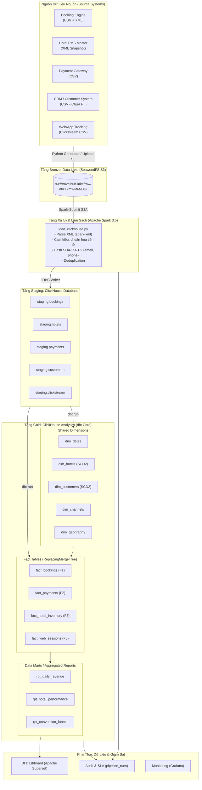

# 🏨 Báo Cáo Kỹ Thuật Chi Tiết: TravelHub Data Platform Pipeline

> **Tài liệu tham chiếu:** [travelhub_platform_summary.md](file:///c:/Users/Admin/Documents/Master/HK1/DE/DE_261_Present/travelhub_platform_summary.md)  
> **Phiên bản:** 1.0 — Ngày lập: 2026-10-01  
> **Lĩnh vực:** Du lịch trực tuyến (Online Travel Agency - OTA)  
> **Mục tiêu hệ thống:** Thu thập, làm sạch đa định dạng (CSV, XML), mô hình hóa Star Schema và phân tích dữ liệu booking, doanh thu, hành vi người dùng đạt SLA trước 06:00 AM hàng ngày.

---

## MỤC LỤC

1. [Mô Hình Kiến Trúc Pipeline (Architecture Model)](#1-mô-hình-kiến-trúc-pipeline-architecture-model)
2. [Cách Thức Pipeline Vận Hành (Execution Flow & Mechanics)](#2-cách-thức-pipeline-vận-hành-execution-flow--mechanics)
3. [Phân Tích Dữ Liệu Qua Từng Chặng (Stage-by-Stage Data Analysis)](#3-phân-tích-dữ-liệu-qua-từng-chặng-stage-by-stage-data-analysis)
   - [3.1. Chặng 0: Raw Ingestion & Data Lake (Bronze Layer)](#31-chặng-0-raw-ingestion--data-lake-bronze-layer)
   - [3.2. Chặng 1: Spark Cleansing & ClickHouse Staging (Silver Layer)](#32-chặng-1-spark-cleansing--clickhouse-staging-silver-layer)
   - [3.3. Chặng 2: Data Modeling & Star Schema (Gold Layer - dbt)](#33-chặng-2-data-modeling--star-schema-gold-layer---dbt)
   - [3.4. Chặng 3: Data Quality & Audit Logging](#34-chặng-3-data-quality--audit-logging)
4. [Hướng Dẫn Sử Dụng & Vận Hành Pipeline (Operations & Usage Guide)](#4-hướng-dẫn-sử-dụng--vận-hành-pipeline-operations--usage-guide)
   - [4.1. Khởi động môi trường hạ tầng](#41-khởi-động-môi-trường-hạ-tầng)
   - [4.2. Chạy Pipeline toàn trình (Automated End-to-End)](#42-chạy-pipeline-toàn-trình-automated-end-to-end)
   - [4.3. Chạy từng bước độc lập (Step-by-Step Execution)](#43-chạy-từng-bước-độc-lập-step-by-step-execution)
   - [4.4. Cơ chế Backfill và xác thực tính Idempotent](#44-cơ-chế-backfill-và-xác-thực-tính-idempotent)
5. [Tổng Kết Đánh Giá & Khuyến Nghị](#5-tổng-kết-đánh-giá--khuyến-nghị)

---

## 1. Mô Hình Kiến Trúc Pipeline (Architecture Model)

Pipeline TravelHub được xây dựng dựa trên nguyên lý **Medallion Architecture (Bronze → Silver → Gold)** kết hợp **Modern Data Stack**, vận hành hoàn toàn trên nền tảng nguồn mở (100% Free & Open-Source Software).

### 1.1. Sơ đồ luồng dữ liệu (Data Pipeline Architecture)



### 1.2. Các thành phần công nghệ (Tech Stack Components)

| Thành phần | Công nghệ | Vai trò kỹ thuật |
|---|---|---|
| **Data Generator** | Python 3 Standard Library | Sinh dữ liệu mô phỏng thực tế đa định dạng (CSV, XML), cố tình đưa dữ liệu bẩn để kiểm thử |
| **Object Storage** | SeaweedFS (S3 API port 8333, Filer port 8888) | Thay thế / tương thích S3/MinIO, đóng vai trò Data Lake hạ cánh dữ liệu thô (Landing Zone) |
| **Processing Engine** | Apache Spark 3.5.3 (Master-Worker) | Xử lý song song, parse XML phân cấp, làm sạch, mã hóa PII, đẩy sang kho dữ liệu |
| **Data Warehouse** | ClickHouse Server 24.3 | Cơ sở dữ liệu cột OLAP, tốc độ nén và tổng hợp (aggregate) cực cao với `ReplacingMergeTree` |
| **Transformation Tool** | dbt Core 1.7 + dbt-clickhouse | Quản lý vòng đời biến đổi dữ liệu (ELT), xây dựng Star Schema, kiểm soát chất lượng qua `dbt test` |
| **Orchestrator** | [scripts/run_pipeline.py](file:///c:/Users/Admin/Documents/Master/HK1/DE/DE_261_Present/scripts/run_pipeline.py) | Điều phối luồng tuần tự, kiểm soát lỗi, timeout, ghi log kiểm toán vào `analytics.pipeline_runs` |
| **BI & Analytics** | Apache Superset 3.1.0 | Trực quan hóa dữ liệu từ ClickHouse phục vụ phòng kinh doanh và điều hành |

---

## 2. Cách Thức Pipeline Vận Hành (Execution Flow & Mechanics)

Pipeline được kích hoạt định kỳ lúc **02:00 AM** mỗi ngày (qua cron hoặc orchestrator). Toàn bộ luồng được điều khiển tập trung bởi file [run_pipeline.py](file:///c:/Users/Admin/Documents/Master/HK1/DE/DE_261_Present/scripts/run_pipeline.py).

### 2.1. Quy trình thực thi tuần tự (5 giai đoạn)

```
02:00 AM (Trigger YYYY-MM-DD)
  │
  ├─► [Giai đoạn 0: Generate Data]
  │     └─ Chạy: generate_sample_data.py [date] /opt/sample-data/raw
  │        Tạo ra 5 thư mục dữ liệu theo phân vùng Hive dt=YYYY-MM-DD.
  │
  ├─► [Giai đoạn 1: Upload Data Lake (S3)]
  │     └─ Kết nối boto3 tới SeaweedFS S3 (bucket: travelhub-lake)
  │        Đẩy toàn bộ file thô lên raw/{source}/dt={date}/*.
  │
  ├─► [Giai đoạn 2: Spark Load to ClickHouse Staging]
  │     └─ Lệnh: spark-submit load_clickhouse.py [date]
  │        Spark đọc S3/local, giải mã XML, chuẩn hóa cột, băm PII,
  │        ghi vào ClickHouse database staging.* qua JDBC.
  │
  ├─► [Giai đoạn 3: dbt Run (Tạo Dimensions, Facts, Reports)]
  │     └─ Lệnh: dbt run --vars '{"execution_date":"YYYY-MM-DD"}'
  │        Thực thi các model SQL tuần tự:
  │        1. Staging Views (chuẩn hóa view)
  │        2. Dimensions (dim_dates, dim_hotels, dim_customers, dim_channels)
  │        3. Marts Facts (fact_bookings, fact_payments, fact_hotel_inventory, fact_web_sessions)
  │        4. Reporting (rpt_daily_revenue, rpt_hotel_performance, rpt_conversion_funnel)
  │
  └─► [Giai đoạn 4: dbt Test (Kiểm tra chất lượng dữ liệu)]
        └─ Lệnh: dbt test --vars '{"execution_date":"YYYY-MM-DD"}'
           Chạy các kiểm thử: Unique, Not Null, Range Check (nights >= 1, amount >= 0).
  │
  ▼
~05:30 AM: Ghi Audit Log hoàn tất vào ClickHouse `analytics.pipeline_runs`.
```

### 2.2. Cơ chế bẫy lỗi và ghi nhận Audit Log
Mỗi bước thực thi trong pipeline đều được bao bọc trong hàm `run_step()` và `audit_log()`:
- Nếu một bước thất bại (`status = FAILED`), pipeline sẽ lập tức ngắt (`fail-fast`), không cho các bước sau chạy để tránh làm nhiễm bẩn dữ liệu tầng Gold.
- Thông tin lỗi (`error_message`), thời điểm chạy (`started_at`, `finished_at`), và mã thực thi (`run_id`) được lưu trực tiếp vào bảng `analytics.pipeline_runs`.

---

## 3. Phân Tích Dữ Liệu Qua Từng Chặng (Stage-by-Stage Data Analysis)

### 3.1. Chặng 0: Raw Ingestion & Data Lake (Bronze Layer)

Tại tầng này, dữ liệu giữ nguyên 100% định dạng gốc do các đối tác và hệ thống tác nghiệp gửi về. Cấu trúc thư mục được phân vùng dạng Hive: `raw/<source>/dt=YYYY-MM-DD/`.

| Nguồn | Định dạng | Tần suất | Kích thước mẫu | Đặc thù dữ liệu & Thách thức |
|---|---|---|---|---|
| **Bookings** | **CSV + XML hỗn hợp** | Hàng ngày (Incremental) | ~500 booking/ngày (70% CSV, 30% XML) | • Chứa tiền tệ lộn xộn: `"1,500,000 VND"`, `"$1,500.00"`, dấu cách.<br>• Trạng thái không nhất quán: `"confirm"`, `"CONFIRM"`, `"1"`, `"CANCELLED"`.<br>• Cố tình chứa bản ghi trùng `booking_id`. |
| **Hotels** | **XML** | Hàng ngày (Full Snapshot) | 50 khách sạn | • Định dạng XML cây phân cấp lồng nhau (`<hotels><hotel>...`).<br>• Cần SCD Type 2 để theo dõi thay đổi thông tin (đổi tên, hạng sao, trạng thái kích hoạt). |
| **Payments** | **CSV** | Hàng ngày (Incremental) | ~450 giao dịch | • Liên kết khóa ngoại với `booking_id`.<br>• Chứa các trường hợp hoàn tiền (`refund_amount`, `refund_at`). |
| **Customers** | **CSV** | Hàng ngày (Full Snapshot) | 200 khách hàng | • **Chứa thông tin PII nhạy cảm**: họ tên, số điện thoại cá nhân, địa chỉ email. Tuyệt đối không được để lọt vào kho dữ liệu analytics. |
| **Clickstream** | **CSV** | Hàng ngày (Incremental) | 2.000 log sự kiện | • Khối lượng lớn, phân theo `session_id`, `user_id` có thể rỗng khi chưa đăng nhập. |

---

### 3.2. Chặng 1: Spark Cleansing & ClickHouse Staging (Silver Layer)

Nhiệm vụ của Spark ở file [load_clickhouse.py](file:///c:/Users/Admin/Documents/Master/HK1/DE/DE_261_Present/spark_jobs/load_clickhouse.py) là xử lý các vấn đề dữ liệu thô trước khi nạp vào ClickHouse:

#### 1. Xử lý đa định dạng & hợp nhất (Multi-format Fusion)
- Dùng `com.databricks.spark.xml` để đọc file XML với `rowTag="booking"` và `rowTag="hotel"`.
- Ghép bảng CSV và XML của nguồn Bookings thông qua hàm:
  ```python
  df = df_csv.unionByName(df_xml, allowMissingColumns=True)
  ```

#### 2. Chuẩn hóa & Làm sạch dữ liệu (Data Cleansing)
- **Tiền tệ:** Dùng biểu thức chính quy `regexp_replace("total_amount", "[^0-9.]", "")` để loại bỏ mọi ký tự chữ cái, ký hiệu tiền tệ, sau đó ép về kiểu `Decimal(15, 2)`.
- **Trạng thái:** Dùng cây logic `F.when` để ánh xạ tất cả biến thể `"confirm"`, `"CONFIRM"`, `"1"` thành chuẩn duy nhất `"CONFIRMED"`.
- **Kênh bán hàng (Channel mapping):** Ánh xạ `"app_ios"`, `"app_android"` → `"Mobile App"`; `"web"`, `"website"` → `"Web"`; `"partner_*"` → `"Partner API"`.
- **Tính toán trường phái sinh:** `nights = datediff(checkout_date, checkin_date)`.

#### 3. Bảo mật thông tin nhận dạng cá nhân (PII Masking)
Đối với bảng Customers, Spark áp dụng hàm băm SHA-256 để che giấu dữ liệu nhạy cảm:
```python
df_clean = df.withColumn("email_hash", F.sha2(F.trim("email"), 256)) \
             .withColumn("phone_hash", F.sha2(F.trim("phone"), 256)) \
             .drop("full_name", "email", "phone")
```

#### 4. Cấu trúc bảng tại ClickHouse Staging (`staging.*`)
Dữ liệu được nạp vào ClickHouse với engine `ReplacingMergeTree(_batch_date)`, phân vùng theo `toYYYYMM(_batch_date)`:
- `staging.bookings`
- `staging.hotels`
- `staging.payments`
- `staging.customers`
- `staging.clickstream`

---

### 3.3. Chặng 2: Data Modeling & Star Schema (Gold Layer - dbt)

dbt đảm nhận vai trò mô hình hóa dữ liệu theo chuẩn KimBall Star Schema bên trong ClickHouse:

```
                            ┌──────────────┐
                            │  dim_dates   │
                            └──────┬───────┘
                                   │
              ┌────────────────────┼────────────────────┐
              │                    │                    │
     ┌────────▼──────┐     ┌───────▼────────┐   ┌───────▼────────┐
     │  dim_hotels   │     │ dim_customers  │   │  dim_channels  │
     │  (SCD Type 2) │     │  (PII Masked)  │   │   (Direct/API) │
     └────────┬──────┘     └───────┬────────┘   └───────┬────────┘
              │                    │                    │
              └───────────┬────────┴────────┬───────────┘
                          │                 │
                  ┌───────▼─────────────────▼────────┐
                  │           FACT TABLES            │
                  │  • fact_bookings        (F1)     │
                  │  • fact_payments        (F2)     │
                  │  • fact_hotel_inventory (F3)     │
                  │  • fact_web_sessions    (F5)     │
                  └──────────────────┬───────────────┘
                                     │
                             ┌───────▼────────┐
                             │ REPORTING MARTS│
                             │ • rpt_daily_rev│
                             │ • rpt_hotel_prf│
                             │ • rpt_funnel   │
                             └────────────────┘
```

#### 1. Dimensions (Chiều Phân Tích)
- **`dim_dates`:** Bảng ngày tháng chứa lịch 3 năm, tính sẵn `quarter`, `day_of_week`, `is_weekend`, `is_holiday` và phân loại mùa du lịch (`high_season`, `low_season`, `regular`).
- **`dim_hotels` (SCD Type 2):** Khách sạn có trường `hotel_sk` (Surrogate Key được sinh từ `cityHash64(concat(hotel_id, valid_from))`), chứa `valid_from`, `valid_to`, `is_current` để theo dõi lịch sử cập nhật.
- **`dim_customers`:** Khách hàng đã mã hóa danh tính, theo dõi phân khúc `user_segment` (`budget`, `standard`, `premium`) và hạng thành viên `loyalty_tier`.
- **`dim_channels`:** Kênh đặt phòng (`Web`, `Mobile App`, `Partner API`, `Other`).

#### 2. Fact Tables (Bảng Sự Kiện)
- **`fact_bookings` (Grain: 1 booking):**
  - Chuyển đổi sang mô hình Incremental: nạp tăng dần theo biến ngày `execution_date`.
  - Thực hiện LEFT JOIN với các Dimension đang có hiệu lực (`is_current = true`) để lấy `hotel_sk` và `customer_sk`.
  - Sinh trường cờ boolean: `is_cancelled = (booking_status == 'CANCELLED')`, `is_no_show = (booking_status == 'NO_SHOW')`.
- **`fact_payments` (Grain: 1 payment transaction):**
  - Gắn khóa ngoại tới `fact_bookings` và khách hàng.
  - Phân tích trạng thái thanh toán, tiền hoàn trả (`refund_amount`).
- **`fact_hotel_inventory` (Grain: hotel × ngày × loại phòng):**
  - Tính toán các chỉ số cốt lõi ngành khách sạn:
    $$\text{Occupancy Rate (\%)} = \frac{\text{Số phòng đã đặt}}{\text{Tổng số phòng}} \times 100$$
    $$\text{ADR (Average Daily Rate)} = \frac{\text{Tổng doanh thu tiền phòng}}{\text{Số phòng đã bán}}$$
    $$\text{RevPAR} = \text{ADR} \times \text{Occupancy Rate}$$
- **`fact_web_sessions` (Grain: 1 phiên truy cập):**
  - Tổng hợp từ clickstream: đếm số trang đã xem (`page_views`), đếm số khách sạn đã xem (`hotels_viewed`), thời lượng phiên (`session_duration_sec`) và cờ đã đặt phòng (`converted`).

#### 3. Reporting Marts (Bảng Báo Cáo Phục Vụ BI)
- **`rpt_daily_revenue`:** Tổng hợp doanh thu theo ngày báo cáo, quốc gia, khu vực, phân hạng khách sạn và kênh đặt phòng; tính tỷ lệ hủy phòng (`cancellation_rate_pct`).
- **`rpt_hotel_performance`:** Xếp hạng các khách sạn có doanh thu cao nhất và tỷ lệ hủy phòng bất thường.
- **`rpt_conversion_funnel`:** Đo lường tỷ lệ chuyển đổi qua các bước: `Xem trang → Tìm kiếm → Xem phòng → Bắt đầu đặt → Hoàn tất đặt phòng`.

---

### 3.4. Chặng 3: Data Quality & Audit Logging

Hệ thống bảo đảm chất lượng dữ liệu thông qua 2 lớp phòng vệ:

1. **Lớp kiểm tra Data Quality (dbt test):**
   - Ràng buộc duy nhất & không rỗng (`unique`, `not_null`) trên tất cả các khóa chính: `booking_id`, `payment_id`, `hotel_sk`, `customer_sk`.
   - Kiểm tra miền giá trị hợp lệ: `nights >= 1`, `total_amount >= 0`.
   - Kiểm tra tính toàn vẹn tham chiếu quan hệ (Relationships integrity).

2. **Lớp kiểm toán hệ thống (`analytics.pipeline_runs`):**
   - Mỗi lần chạy ghi lại nhật ký chi tiết:
     ```sql
     SELECT run_id, step_name, status, rows_processed, started_at, error_message
     FROM analytics.pipeline_runs
     ORDER BY started_at DESC;
     ```

---

## 4. Hướng Dẫn Sử Dụng & Vận Hành Pipeline (Operations & Usage Guide)

### 4.1. Khởi động môi trường hạ tầng

Mở terminal tại thư mục gốc của dự án (`DE_261_Present`) và khởi chạy Docker Compose:

```powershell
# 1. Khởi động toàn bộ container chạy ngầm
docker compose up -d

# 2. Kiểm tra trạng thái containers
docker compose ps
```

Các cổng giao tiếp trên máy host:
- **SeaweedFS S3 API / UI:** `http://localhost:8333` (S3) / `http://localhost:8888` (Web Filer UI)
- **Spark Master UI:** `http://localhost:8880`
- **ClickHouse HTTP:** `http://localhost:8123`
- **Apache Superset BI:** `http://localhost:8088` (admin / admin)
- **Grafana Monitoring:** `http://localhost:3000`

---

### 4.2. Chạy Pipeline toàn trình (Automated End-to-End)

Cách đơn giản và chuẩn xác nhất là kích hoạt bộ điều phối trong container `travelhub-pipeline`:

```powershell
# 1. Đi vào bên trong container điều phối
docker exec -it travelhub-pipeline bash

# 2. Chạy pipeline cho một ngày cụ thể (hoặc để trống để nhận ngày hôm nay)
python3 /opt/scripts/run_pipeline.py 2026-10-01
```

*Lệnh trên sẽ tự động: Sinh dữ liệu → Upload S3 → Spark nạp Staging → dbt run → dbt test → Ghi audit log.*

---

### 4.3. Chạy từng bước độc lập (Step-by-Step Execution)

Nếu đang debug hoặc muốn kiểm soát từng chặng, hãy thực hiện lần lượt các lệnh sau trong container:

```bash
# Bước 1: Sinh dữ liệu mẫu ra đĩa
python3 /opt/scripts/generate_sample_data.py 2026-10-01 /opt/sample-data/raw

# Bước 2: Nạp dữ liệu qua Spark vào ClickHouse Staging
spark-submit \
  --master spark://spark-master:7077 \
  /opt/spark-jobs/load_clickhouse.py 2026-10-01 /opt/sample-data/raw

# Bước 3: Chạy dbt để biến đổi sang Star Schema
cd /opt/dbt
dbt run --profiles-dir . --project-dir . --vars '{"execution_date":"2026-10-01"}'

# Bước 4: Chạy bộ kiểm thử chất lượng dữ liệu
dbt test --profiles-dir . --project-dir . --vars '{"execution_date":"2026-10-01"}'
```

---

### 4.4. Cơ chế Backfill và xác thực tính Idempotent

Pipeline được thiết kế theo nguyên tắc **Idempotent** (chạy lại nhiều lần trên cùng một ngày không làm nhân bản dữ liệu hay sai lệch chỉ số).

#### Kiểm tra tính Idempotent:
1. Chạy lại lệnh pipeline cho cùng ngày `2026-10-01`:
   ```bash
   python3 /opt/scripts/run_pipeline.py 2026-10-01
   ```
2. Mở `clickhouse-client` kiểm tra số dòng:
   ```powershell
   docker exec -it travelhub-clickhouse clickhouse-client -u travelhub --password clickhouse_secret_2026
   ```
   ```sql
   -- Số dòng phải giữ nguyên, không bị nhân đôi
   SELECT count(*) FROM analytics.fact_bookings WHERE _batch_date = '2026-10-01';
   ```

#### Chạy Backfill cho chuỗi nhiều ngày:
Để nạp dữ liệu lịch sử cho nhiều ngày liên tiếp:
```bash
for d in 2026-10-01 2026-10-02 2026-10-03; do
    python3 /opt/scripts/run_pipeline.py $d
done
```

---

## 5. Tổng Kết Đánh Giá & Khuyến Nghị

### 5.1. Điểm mạnh của kiến trúc hiện tại
1. **Khả năng chịu lỗi và xử lý dữ liệu bẩn xuất sắc:** Khử bỏ tốt các rác định dạng tiền tệ, trạng thái phi chuẩn và trùng lặp booking.
2. **Tuân thủ chuẩn bảo mật quốc tế:** Dữ liệu PII của khách hàng được băm SHA-256 ngay từ tầng Spark trước khi vào ClickHouse, bảo đảm tuân thủ GDPR và quy chuẩn dữ liệu cá nhân.
3. **Mô hình Star Schema chuẩn chỉnh:** Phân tách rõ ràng Dimensions (SCD2 cho khách sạn/khách hàng) và Facts tăng dần (Incremental load), hỗ trợ đắc lực cho các câu lệnh truy vấn phân tích doanh thu phức tạp.
4. **Hiệu năng vượt trội:** Sự kết hợp giữa Apache Spark (tính toán phân tán) và ClickHouse (lưu trữ cột tốc độ cao) giúp xử lý khối lượng lớn dữ liệu trong vài phút.

### 5.2. Khuyến nghị phát triển cho các giai đoạn tiếp theo
- **Lập lịch chuyên nghiệp:** Nâng cấp từ script điều phối sang **Apache Airflow OSS** hoặc **Dagster** với đồ thị DAG trực quan, SLA alerting và tự động retry.
- **Xử lý Real-time:** Bổ sung **Apache Kafka** và **Spark Streaming** để tiếp nhận các luồng dữ liệu clickstream và booking phát sinh theo thời gian thực (Near real-time dashboard).
- **Data Lineage:** Bổ sung công cụ siêu dữ liệu như **OpenMetadata** để theo dõi nguồn gốc dữ liệu từ file thô đến báo cáo BI.
